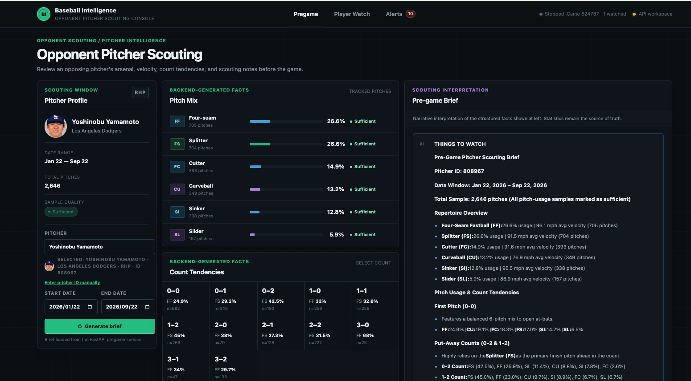
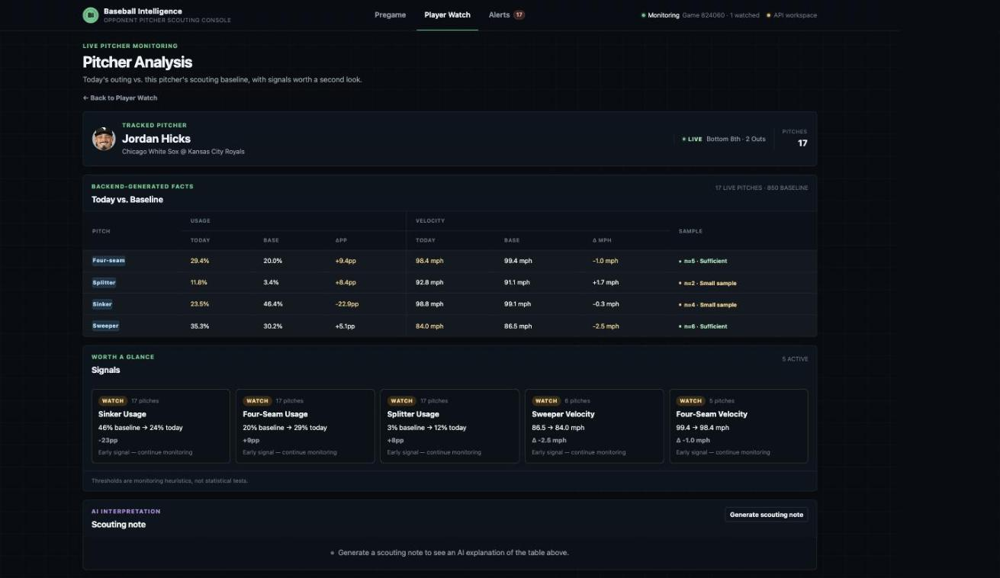
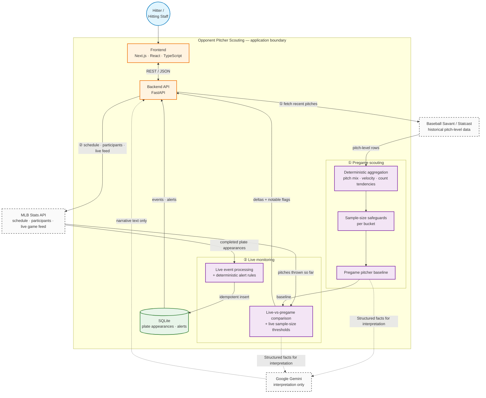

# Opponent Pitcher Scouting

[](https://github.com/kaohaohan/taiwanese-baseball-watch/actions/workflows/ci.yml)
[](https://taiwanese-baseball-watch.vercel.app)

A game-preparation tool that builds an opposing pitcher's pregame Statcast
baseline, monitors his live approach, and flags meaningful deviations during
the game — deterministic stats first, Gemini for narration only.



**[Try the live demo →](https://taiwanese-baseball-watch.vercel.app)**
Search a pitcher on Pregame, hit **Generate Brief**, then check Player Watch
for a completed game.

<details>
<summary>Live pitcher monitoring screenshot</summary>



A watched pitcher's live plate appearances as they happen, tracked against his pregame baseline.

</details>

## Core workflow

```
Pregame opponent selection
  → Baseball Savant / Statcast baseline
  → deterministic aggregation
  → scouting brief
  → MLB game selection
  → live pitcher monitoring
  → pregame vs. live comparison
  → alerts / AI interpretation
```

Before first pitch, pick an opposing pitcher and pull his recent Statcast
pitches into a pitch-mix, velocity, and count-tendency baseline, then have
Gemini describe that baseline in prose. Once the game starts, pick it from a
date-based schedule picker, add pitchers to a watchlist, and the same
pitcher's live pitch mix is continuously compared back against his pregame
baseline — with Gemini narrating only the deviations the backend already
flagged as notable.

<details>
<summary><strong>Architecture</strong> (click to expand diagram)</summary>



**Gemini does not compute the core baseball statistics or determine
deterministic alerts.** The backend computes the facts first (pitch usage,
velocity, sample sizes, pregame-vs-live deltas) and only then sends a
structured summary to Gemini for interpretation. Gemini never reads from the
MLB Stats API, Statcast, or SQLite, and never writes to them. Deterministic
statistics, comparisons, and alerting remain available independently of
Gemini.

</details>

<details>
<summary><strong>Engineering highlights</strong></summary>

- DB-backed idempotent ingestion — `UNIQUE(game_id, at_bat_index)` with
  `INSERT ... ON CONFLICT DO NOTHING RETURNING id`, so replaying or
  re-polling a game creates no duplicate rows or alerts
- Deterministic aggregation kept strictly separate from LLM interpretation —
  the comparison and pregame-brief endpoints compute every number before an
  LLM ever sees the request
- Per-bucket sample-size safeguards (pregame Statcast window and live in-game
  window use independent, appropriately-sized thresholds)
- Defensive MLB/Statcast parsing — UTF-8 BOM handling, missing measurements
  kept as `NULL` instead of being coerced to misleading zeros
- Role-aware batter/pitcher monitoring and alerting
- Live vs. pregame pitch-mix comparison, reconciling Statcast's short pitch
  codes against the MLB live feed's inconsistent naming
- Frontend live-monitoring session persists across route navigation
- Date-based MLB schedule/game picker
- Explicit failure-state handling — source errors, partial ingestion, and
  LLM failures are reported, never silently swallowed
- Testable external-service boundaries — MLB, Statcast, and Gemini are all
  behind small interfaces with fakes used throughout the test suite

</details>

## Tech stack

**Frontend:** Next.js · React · TypeScript · TanStack Query

**Backend:** FastAPI · Python · SQLAlchemy · SQLite

**Data / integrations:** MLB Stats API · Baseball Savant / Statcast · Gemini API

<details>
<summary><strong>Local setup</strong> (run it yourself)</summary>


Requires Python 3.12 and Node 22.

```bash
# backend
python3.12 -m venv .venv
source .venv/bin/activate
pip install -r requirements-dev.txt   # or requirements.txt without the test deps

export GEMINI_API_KEY=your-key-here   # optional locally; required for the
                                       # scouting brief and AI comparison notes

uvicorn app.main:app --reload
```

Interactive API docs: <http://127.0.0.1:8000/docs>.

```bash
# frontend, in another terminal
cd frontend
npm install
npm run dev
```

Open <http://localhost:3000> (redirects to `/pregame`). The dashboard talks
to FastAPI through a same-origin Next.js rewrite (`/backend/api/...` →
`FASTAPI_BASE_URL`, defaulting to `http://127.0.0.1:8000`).

## Deployment

The live demo runs on Vercel + Railway, deployed from `main`:

```
Browser → Vercel (Next.js, root: frontend/)
            │ /backend/:path* rewrite → FASTAPI_BASE_URL
            ▼
          Railway (FastAPI, uvicorn, 1 replica)
            ├─ MLB Stats API
            ├─ Baseball Savant / Statcast
            ├─ Gemini API (backend-only key)
            ▼
          Railway Volume /data → SQLite (watch.db)
```

**Backend (Railway)** — start command, and required env vars:

```
uvicorn app.main:app --host 0.0.0.0 --port $PORT
```

| Variable | Value |
| --- | --- |
| `DATABASE_URL` | `sqlite:////data/watch.db` |
| `GEMINI_API_KEY` | (secret, backend-only) |
| `RAILPACK_PYTHON_VERSION` | `3.12` |

A persistent volume is mounted at `/data` so the SQLite file survives
redeploys. Single replica only — SQLite doesn't support concurrent writers
across instances.

**Frontend (Vercel)** — root directory `frontend`, production branch `main`,
one env var:

| Variable | Value |
| --- | --- |
| `FASTAPI_BASE_URL` | the Railway backend's public URL |

No `NEXT_PUBLIC_*` variable is used, and the Gemini key is never set on
Vercel — the browser only ever calls the same-origin `/backend/*` rewrite, so
the Railway URL and the Gemini key both stay server-side.

**Portfolio/demo limitation:** SQLite on a single Railway volume is
appropriate for this low-traffic demo, not multi-instance production scale.
A production deployment would move persistence to PostgreSQL and run the
backend on a platform with a managed database, as noted in Design decision B
below.

</details>

<details>
<summary><strong>Design decisions</strong></summary>

**A. Deterministic stats are separate from Gemini.** Every statistic, delta,
and sample-size flag is computed by plain Python before any LLM call, so the
numeric endpoints are correct and available even when Gemini is slow, down,
or misconfigured.

**B. SQLite is appropriate for the current portfolio/demo scope.** The
current workload is local and single-process, so SQLite keeps setup simple
while still providing database-backed constraints and idempotency. A
multi-worker production deployment would move persistence to a production
database such as PostgreSQL.

**C. Live sync is currently client-driven.** The current demo uses
client-driven polling for simplicity: the browser triggers each sync while
Player Watch is open. A production multi-user version would move ingestion to
a server-side worker/scheduled process independent of browser lifecycle. That
worker is not implemented here.

**D. The product is descriptive/scouting-oriented, not predictive.** It
reports what a pitcher has actually thrown and how tonight compares to his
baseline — it does not forecast the next pitch or project outcomes.

**E. Sample-size thresholds exist** because a handful of live pitches (or a
rarely-thrown pitch type) isn't a reliable signal; low-sample rows stay
visible but are flagged `insufficient_sample` instead of being dropped or
silently trusted.

</details>

## Testing

Local verification, all currently passing:

- 172 backend tests (`pytest -q`)
- `ruff check .`
- Frontend TypeScript check (`npm run typecheck`)
- Frontend production build (`npm run build`)

CI runs the same checks on every push and pull request via
[`.github/workflows/ci.yml`](.github/workflows/ci.yml).

## Known limitations

- SQLite (on a single Railway volume in the live demo) is appropriate for
  local/demo use, not multi-worker production writes
- Client-driven live polling stops when no client session is active
- No authentication
- Statcast data is fetched on demand; no persistent caching layer
- Scouting outputs are descriptive, not predictive
- Gemini interpretation can fail independently; deterministic numeric output
  remains available regardless

---

<details>
<summary><strong>Reference</strong> — API surface, watch rules, per-phase design writeups (for engineers who want to dig further)</summary>

### API

| Method | Path | Notes |
| --- | --- | --- |
| `GET` | `/api/players` | Batter-oriented list of players we have seen plate appearances for |
| `GET` | `/api/events` | Stored plate appearances. Filters: `game_id`, `batter_id`, `pitcher_id`, `limit` |
| `GET` | `/api/alerts` | Alerts, newest first. Filters: `rule_type`, `subject_role`, `limit` |
| `POST` | `/api/replay` | Development/demo only. Replays a fixture through the pipeline |
| `GET` | `/api/live/games?date=YYYY-MM-DD` | MLB schedule used by the date-based Game Picker |
| `GET` | `/api/live/games/{game_id}/participants` | Read-only MLB game participant discovery |
| `POST` | `/api/live/sync` | Fetches one MLB live snapshot and ingests completed PAs for selected `batter_ids`/`pitcher_ids` |
| `GET` | `/api/pregame/pitchers/search?query=...` | Pitcher name search / MLBAM discovery |
| `POST` | `/api/pregame/brief` | Statcast pitch-usage aggregation + Gemini-written scouting brief. Body: `pitcher_id`, `start_date`, `end_date` |
| `GET` | `/api/live/games/{game_id}/pitchers/{pitcher_id}/comparison` | Deterministic pregame-vs-live pitch-mix comparison. Never calls Gemini |
| `POST` | `/api/live/games/{game_id}/pitchers/{pitcher_id}/comparison/note` | On-demand Gemini explanation of that same comparison |
| `GET` | `/health` | Liveness |

Interactive docs at `/docs`.

### Watch rules

| Rule | Condition |
| --- | --- |
| `extra_base_hit` | `result` in Double, Triple, Home Run |
| `hard_contact` | `exit_velocity >= 100` mph |
| `high_velocity_hit` | `pitch_velocity >= 95` mph **and** `result` is a hit |
| `pitcher_extra_base_hit_allowed` | Watched pitcher allowed a double, triple, or home run |
| `pitcher_high_exit_velocity_allowed` | Watched pitcher allowed `exit_velocity >= 100` mph |

### Sample-size rules (live comparison)

| Threshold | Value | Guards |
| --- | --- | --- |
| `MIN_LIVE_PITCHES_FOR_ANY_CLAIM` | 10 | The outing as a whole |
| `MIN_PITCH_TYPE_SAMPLE` | 5 | One pitch type's own row |
| `NOTABLE_USAGE_DELTA_PP` | 10.0 pp | A sufficient row's usage delta must clear this to be notable |
| `NOTABLE_VELOCITY_DELTA_MPH` | 1.5 mph | A sufficient row's velocity delta must clear this to be notable |

Pregame Statcast aggregation uses its own, larger threshold
(`MIN_SAMPLE_SIZE = 20`, applied per bucket) since it draws from a
multi-game window rather than a single live outing.

### Failure handling

Failures are counted, logged, and reported — never swallowed:

| Kind | Handling |
| --- | --- |
| Plate appearance not complete | `ignored_incomplete` — expected, not a failure |
| Event fails validation | `invalid`, logged with game id and at-bat index; the rest of the source continues |
| The source itself fails | Logged with a traceback, returned as `source_error`; that drain stops, but events already ingested are not rolled back |

| Condition | `GET .../comparison` | `POST .../comparison/note` |
| --- | --- | --- |
| No pregame baseline | `200`, `baseline_available: false` | `200`, note explains no baseline |
| Insufficient live sample | `200`, `insufficient_sample` | `200`, cautious note |
| `GEMINI_API_KEY` unset | unaffected | `503` |
| Gemini request failure/timeout | unaffected | `502` |
| Baseball Savant / MLB feed down | `502` | `502` |
| Game not found | `404` | `404` |

### Code layout

```
app/
├── main.py, config.py, db.py, migrations.py, models.py, schemas.py
├── repository.py       the only module that writes SQL; owns conflict handling
├── api/routes.py        REST endpoints for replay, live monitoring, pregame, and comparison
├── sources/              LiveSource (MLB), ReplaySource (fixture), ScheduleSource
├── processing/           PlateAppearanceProcessor pipeline
├── rules/                watch rules (pure functions) + RuleEngine
├── pregame/              Statcast baseline + Gemini scouting brief
└── comparison/           pregame-vs-live comparison + Gemini narration

frontend/
├── app/                  pregame, player-watch, alerts routes
├── components/           GamePicker, PlayerWatch, PitchMixComparison, ...
└── lib/                   api client, TanStack Query hooks, live-monitoring provider
```

`app/pregame/`, `app/comparison/`, and the event-monitoring pipeline remain
intentionally separated. Pregame builds the historical Statcast baseline
without touching `watch.db`, while comparison combines that baseline with the
current MLB live-feed snapshot without modifying either source.

</details>
